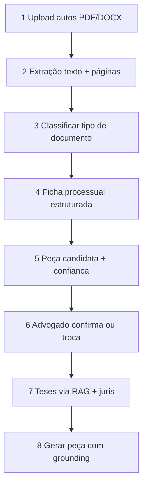

# Proposta: leitura de autos → peça cabível + teses

**Status:** draft para análise — **não implementar** até aprovação explícita.  
**Canvas:** `proposta-leitura-autos` (abrir ao lado do chat no Cursor).

## Objetivo de produto

O advogado faz upload do processo (ou da sentença/decisão). O FACTO:

1. Extrai o que importa (ficha processual).
2. Sugere a **peça cabível** (recurso inominado, embargos, etc.) com confiança.
3. **Espera confirmação humana.**
4. Propõe **teses** via RAG (`base_conhecimento` + juris) e só então gera a peça.

Não é “mandar o PDF inteiro no Gemini”. Também não é LangChain + Pinecone — reutilizamos o stack atual.

## Por que não só chunking vetorial

Escolher recurso/embargos/agravo depende de **momento e natureza da decisão**, não só de similaridade semântica. Chunking + pgvector entram **depois** (teses, citações com página, resumos longos).

## Pipeline (8 etapas)

| Etapa | Entrada | Saída | Stack sugerido |
|-------|---------|-------|----------------|
| 1 Upload | Arquivo(s) | Blob + metadados | Form JEC (modo “Com autos”) |
| 2 Extração | PDF/DOCX | Texto por página | `pdf-parse` / `mammoth` (já no repo) |
| 3 Classificação | Texto | sentença / decisão / petição / outros | Gemini curto + heurísticas |
| 4 Ficha | Docs classificados | JSON: órgão, partes, nº, data, dispositivo, pedidos | Gemini estruturado |
| 5 Peça | Ficha | tipo + confiança + justificativa | Evolução do Assistente FACTO |
| 6 Confirmação | UI | tipo definitivo | Obrigatório |
| 7 Teses | Ficha + tipo | trechos RAG + juris sugerida | `buscarConhecimentoRelacionado` + fluxo juris atual |
| 8 Geração | Tudo confirmado | Peça + grounding | `gerar-peca` atual |

## Reaproveitamento no FACTO

- `assistente-facto.ts` — de “fatos → ação” para “ficha → peça”
- Embeddings / `match_base_conhecimento` — teses e lastro
- `verificacao-citacoes.ts` — anti-alucinação
- Cota juris + fila de verificação — inalterados na lógica
- **Fora do MVP:** LangChain, Pinecone, OCR, Map-Reduce de 500 páginas

## MVP proposto (1º ciclo)

**Entrada:** PDF de sentença ou decisão (opcional: petição inicial).  
**Peças:** recurso inominado (JEC), embargos de declaração; inicial continua no Assistente atual.  
**Pronto quando:** ficha preenchida → peça candidata → confirmação → geração com lastro.

## Depois (P1+)

- Chunking fino + “Verificar na página X”
- Map-Reduce (resumo global / linha do tempo)
- OCR; ZIP com várias peças
- Mais espécies recursais fora do JEC

## Decisões abertas (marcar antes de codar)

1. MVP só sentença/decisão, ou autos completos já no v1?
2. Catálogo MVP = recurso inominado + embargos (+ inicial atual)?
3. Confirmação humana sempre obrigatória? (sugestão: **sim**)
4. UX: modo “Com autos” no fluxo JEC atual?
5. A etapa de análise consome cota de peça / meia cota / grátis? (alinhar CDC)

## Fora de escopo nesta proposta

- Worker Chromium TJSP, STJ, política CDC 7 dias (permanecem na `PENDENCIAS.md`).
